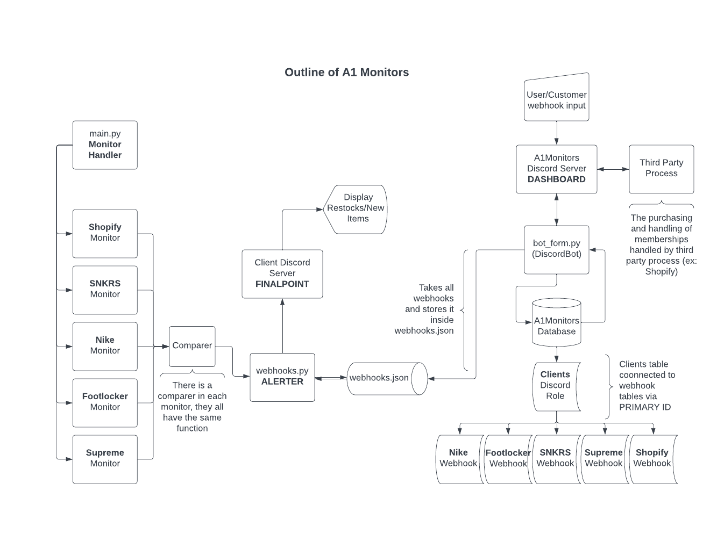

# A1 Monitor

## Description
A python based application that uses the requests library to parse and store HTML data from popular commerce websites. The application then compares the data to check for any changes, and if there are any updates, it will broadcast messages via Discord webhooks with the appropriate information.

## How To Run
1. In the terminal run `python src/main.py` to start the main program.
2. In the terminal run `python bot/bot_form.py` to start the Discord bot that would handle user requests to the service.

## Diagram Outlining the Service Architecture

